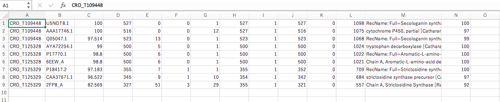

# **Introduction to Bioinformatics (1)**  
**Koki Hayashi**  
 Department of molecular biology and biotechnology, Faculty of Pharmaceutical Sciences.  

This is a tutorial to learn basic and practical bioinformatics created for undergraduate students majoring in pharmacy or pharmaceutical sciences. All methods and opinions here are independent of the institute to which the author belongs (10 March 2020).

<!-- TOC depthFrom:1 depthTo:6 withLinks:1 updateOnSave:1 orderedList:0 -->
 **Introduction to Bioinformatics (1)**
- [はじめに](#はじめに)
- [1. RならびにRstudioのインストール](#1-RならびにRstudioのインストール)
- [2. Linuxを使えるようにする](#2-Linuxを使えるようにする)
- [3. MiniCondaのインストール](#3-MiniCondaのインストール)
- [4. パスについて](#4-パスについて)
- [5. ATOMをインストールする](#5-ATOMをインストールする)
- [6. 解析ソフト(blast)を使ってみる](#6-解析ソフト(blast)を使ってみる)
<!-- /TOC -->

### はじめに
　近年のITの発達、とりわけ機械学習、人工知能 (AI)の発達は目覚しいものです。生物学でもコンピュータに頼ったデータ解析なしでは、最先端の研究には追いつけない時代となりました。では、私たちも初めから最後までAIについて勉強すべきでしょうか？いいえ、化学・生物学を主に学んできた私たちが、情報学を学んできた方々と同じことをしていても追いつくことは困難ですし、私たちの強みを活かせません。極論すれば、私たちは、ツールを使用できればそれでいいのです。もっとも重要なのは、化学・生物学的視点から解析結果を分析し、そこから意味のある解釈を引き出すことです。ただし、その解釈が妥当なものなのか、意義のあるものなのか判断するためには、ツールのアルゴリズムを理解することが不可欠です。したがって、自分とそして研究室の仲間を納得させられる程度には、ツールの概念を理解するようにしましょう。  
　さて、このイントロダクション前半では、皆さんが直面すると予想されるいくつかの壁を取り上げ、それを乗り越える方法を提示しようと思います。プログラミングそのものは、慣れてしまえばとても簡単なものです。しかし、初期のインストール、環境設定等、「慣れるまで」が少し大変です。私も環境設定等のコンピュータについてのより基礎的な知識が必要な部分に関しては自信がありません。後半では、excel、Rの使い方等、より実践的な方法を紹介します。本来なら、今流行りのPythonをやりたいところですが、私の慣れ親しんだRでやらせてください。(多少は触れるようにします)  

　それでは、これからバイオインフォマティクスのイントロダクションを始めますが、その前にちょっとしたアドバイスを。  
　**一度に全てを学ぼうとしないでください！**　そして、　**Google先生に頼りましょう！**  
皆さんの目標 (ヒートマップやSOMを作ってみたい等)に必要最低限のことを学んで、とにかく形にしてみましょう。綺麗にしたり、より高度な解析をしたりするのはその後で大丈夫です。本を買って高度なコードを学ぶよりも、実際に目の前の課題に取り組むほうがよっぽど効率よく身につきます。うまくいかないことがあればそのたびにgoogleで検索してください。皆さんよりも先にその問題に行き当たった人が必ずいます。また、本を利用するのならこのタイミングで参照しましょう。目標にたどり着こうとする間に多くのことを学んでいることに気がつくことでしょう。初めのうちはノートを作るとよいかもしれません。ノートの片側にやりたいことを書いて、反対側にそのやりたいことを達成するために使ったツール、作ったコードをメモしていきます。これは私のやり方です。皆さんは自分のやり方を探してみてください。  
それではよろしくお願いします。

### 1. RならびにRstudioのインストール
Rは統計解析向けの関数型のプログラミング言語で、古くから使われているため、ライブラリが豊富です。時代はPythonですが、生物学の世界では依然として人気があります。RNA-seqの遺伝子変動解析ツール ([DESeq2](https://bioconductor.org/packages/release/bioc/html/DESeq2.html), [edgeR](https://bioconductor.org/packages/release/bioc/html/edgeR.html))等、Pythonではまだ整備されていないパッケージもあることが理由の一つでしょう。(パッケージとは誰かが作って公開してくれた便利でありがたいコードのことです。Rの場合は中で関数が定義されています。)  

最新版の[R](https://cran.ism.ac.jp)をダウンロードしましょう。指示にしたがってインストールし、アプリケーションのディレクトリにRが入っていれば大丈夫です。  

[Rstudio](https://rstudio.com/products/rstudio/download/#download)もインストールしておきましょう。無料のバージョンで十分です。Rstudioは統合開発環境を提供するアプリケーションです。とっても使いやすいです。  

RとRstudioの使い方は後ほど演習をしながら説明します。

### 2. Linuxを使えるようにする  
ゲノミクスの解析 (NGS解析)に利用するツールの多くは、LinuxまたはmacOSのもとで動くように作られています。そのため、Windowsで解析をする場合には、Linuxを使えるように環境を整える必要があります。macOSを使用している場合は、terminalがデフォルトでインストールされていますので、それを使いましょう。  
Windowsの場合は、以下の方法があります。おすすめは1.です。  
1. Windows10のWSL (Windows subsystem for Linux)を用いる。[WSLのインストール ガイド](https://docs.microsoft.com/ja-jp/windows/wsl/install-win10)。さらに[cmder](https://cmder.net)をターミナルとして使うとよいかもしれません。
1. [Cygwin](https://www.cygwin.com)をインストールする。
1. [VirtualBox](https://www.virtualbox.org)をインストールして仮想マシンをつくる。

### 3. MiniCondaのインストール  
パッケージマネージャをインストールしましょう。Minicondaを使うことで簡単にいろいろな解析ソフトをダウンロードできます。目的のソフトに必要な関連ソフトも同時にダウンロード・バージョン管理してくれるからです。MinicondaはAnacondaのコンパクト版です。Anacondaはpythonを用いたプログラミングではもっとも人気のあるディストリビューションですが、多様な言語に対応しています。baseとは別にpython2の仮想環境を構築するのも簡単です。

[Miniconda](https://docs.conda.io/en/latest/miniconda.html)をインストールしましょう。自分のパソコンにあったインストーラをダウンロードし、インストーラの指示にしたがってインストールしましょう。インストールが終わったら、terminalを開いて、

~~~bash
  $ conda
~~~
と打ってみましょう。以下のような画面が出れば成功です。

~~~
usage: conda [-h] [-V] command ...

conda is a tool for managing and deploying applications, environments and packages.

Options:

positional arguments:
  command
    clean        Remove unused packages and caches.
    config       Modify configuration values in .condarc. This is modeled
                 after the git config command. Writes to the user .condarc
                 file (/Users/kokih/.condarc) by default.
    create       Create a new conda environment from a list of specified
                 packages.
    help         Displays a list of available conda commands and their help
                 strings.
    info         Display information about current conda install.
    init         Initialize conda for shell interaction. [Experimental]
    install      Installs a list of packages into a specified conda
                 environment.
    list         List linked packages in a conda environment.
    package      Low-level conda package utility. (EXPERIMENTAL)
    remove       Remove a list of packages from a specified conda environment.
    uninstall    Alias for conda remove.
    run          Run an executable in a conda environment. [Experimental]
    search       Search for packages and display associated information. The
                 input is a MatchSpec, a query language for conda packages.
                 See examples below.
    update       Updates conda packages to the latest compatible version.
    upgrade      Alias for conda update.

optional arguments:
  -h, --help     Show this help message and exit.
  -V, --version  Show the conda version number and exit.

conda commands available from other packages:
  build
  convert
  debug
  develop
  env
  index
  inspect
  metapackage
  render
  server
  skeleton
  verify
~~~  

インストーラがPATHを通してくれますので、minicondaに含まれているパッケージ、インストールしたパッケージはどこからでもパスなしのコマンドで呼び出すことができます。

### 4. パスについて

ここで、パスについて簡単に触れます。パスとはファイルの位置のことです。パスには相対パスと絶対パスがあります。  
相対パス：現在いるワーキングディレクトリとの相対的位置  
絶対パス：rootディレクトリから見た位置

bashコマンド (Linuxのコマンドラインで打ち込むコマンド)に慣れるためにも少しだけ手を動かしてみましょう。bashではスペースの有無が重要ですので気をつけましょう。

~~~bash
  $ pwd # ワーキングディレクトリを表示します pwd; present working directory
  $ cd  # ホームディレクトリに移動します。cd; change directory
  $ ls # ワーキングディレクトリ内のファイルを表示します
  $ ls -l # "-" はオプションの前につけます -lは権限等の詳細を表示します
  $ cd .. # 一つ上の階層のディレクトリに移ります。相対パスの一つです
  $ cd ~/Desktop # Desktopに移動します。〜はホームディレクトリを意味します。〜は省略可。絶対パスの一つです
  $ which conda # condaコマンドの実行ファイルはどこに？
~~~

少しずつ慣れてください。キーボードのショートカットをも覚えると便利です。便利なものを以下に挙げます。他にもたくさんありますので、調べてみてください。  
- tabを押すことで、パスが補完されます。  
- 途中まで名前が同じファイルが複数ある場合は、二回tabを押すと候補一覧が出ます。  
- 上矢印や下矢印を押すと、これまでに実行したコマンドを表示します。  

$PATHについても少しだけ説明します。$PATHはコマンド検索パスと呼ばれます。$PATHは環境変数の一つで、どのディレクトリからでも参照することができます。先の例で、pwd, cd, ls等のコマンドを実行してもらいましたが、これらにも実行ファイル (コンピュータが理解できるようにコンパイルされた指令が書き込まれたファイルのこと)が存在します。例えばlsには/bin/lsという実行ファイルが存在します。lsと打ち込むとこの実行ファイルが呼び出されて、中身が実行され出力結果が画面に表示されます。$PATHの中には、/binを含めていくつかのディレクトリの絶対パスが優先度の高い順に保持されています。パスを指定しないでコマンドを打つと、Linuxは$PATHに保存されているディレクトリ内を順番に探して、そのコマンドと同名のファイルを探し出して実行します。  
$PATHを表示させてみましょう。

~~~bash
  $ echo $PATH
~~~

echoは変数や文字列を表示させるコマンドです。また、bashでは変数の前に$をつけます。下のような結果が表示されるはずです。左から優先度が高い順です。  

~~~bash
  //anaconda3/bin:/usr/local/bin:/usr/bin:/bin:/usr/sbin:/sbin:/opt/X11/bin
~~~

これを見るとわかるようにAnacondaは、$PATHの最上位に追加されています。したがって、Anacondaでインストールしたパッケージが他よりも優先されます。$PATHを書き変えるには、exportを利用します。

~~~bash
  $ export PATH=$PATH:~/miniconda3/bin　# 実行しなくてよい
~~~
このコマンドで$PATHの最後にminicondaを付け加えることができます。

### 5. ATOMをインストールする
ATOMは2015年にリリースされた新しいテキストエディタです。テキストエディタは皆さんがコードを書くためのアプリです。選択肢はたくさんありますが、[ATOM](https://atom.io)がいいのではないかと思います。ダウンロードしてインストールしてください。インストールしたら、ATOMがアプリケーションのディレクトリに入っていることを確認してください。この.mdファイルもATOMで編集しています。  
Rscriptを書くときにはRstudioでよいと思いますが、その他の言語はATOMがよいかもしれません。(pythonには大人気のjupyter notebookという対話型実行環境があります)ATOMは有名なソフトウェア開発プラットホームであり、ソースコードのリポジトリでもある[GitHub](https://github.com)にサポートされていて、多くのPackageを利用することができるため、簡単に機能を拡張できます。  
使い方は演習を通して説明します。

### 6. 解析ソフト(blast)を使ってみる
ソフトはAnacondaのリポジトリからインストールするのがもっとも簡単です。したがって、使いたいツールがある場合にはまず、[Anaconda Cloud](https://anaconda.org/anaconda/repo)を探しましょう。解析ソフトを使用する前には、できるだけ**Documentationに目を通しておく**ようにしましょう。  

通常どのようにツールのインストールにいたるかblastのインストールを例にして考えたいと思います。

1. 実現したいアイディアが浮ぶ。 #2. から始まることもしばしばです。
1. そのアイディアを実現している論文を見つける。
1. 2.の論文のreferencesからツールの元論文を探す。
1. ツールが発表されている論文のインパクトファクター、被引用件数等を見る。
1. ざっと論文に目を通し、自分の目的に合ったものであるか見極める。
1. Documentation, user manualを読む。
1. ツールがAnacondaでインストールできるかgoogleで調べる。(anaconda blast 等で検索)
1. 可能なら指示にしたがってconda installする。できないなら論文に戻ってその記述の通りにインストールする。(Anaconda cloudにあったらラッキーっていう具合です)

今回は6.から始めましょう。  
[BLAST Command Line Applications User Manual](http://ecoevo.unit.oist.jp/site/wp-content/uploads/2013/08/BLAST+_Manual.pdf)をみてみましょう。[A short tutorial on how to run local BLAST](https://github.com/jarekbryk/localblast)も参考になります。  

今回は例として、ニチニチソウゲノム ([Franke, Jakob et al. (2018), Data from: Gene discovery in Gelsemium highlights conserved gene clusters in monoterpene indole alkaloid biosynthesis, Dryad, Dataset](https://datadryad.org/stash/dataset/doi:10.5061/dryad.08vv50n))を用います。後ほど使うfastaファイルとgffファイルも一緒にダウンロードします。コマンドラインからダウンロードする必要はありませんが、試しにコマンドラインからダウンロードしてかまいません。websiteからダウンロードして、~Desktop/bioinfo_introに入れていただいてもかまいません。（この方が簡単ですね）

~~~bash
  $ conda install -c bioconda blast # condaを用いてblastをインストールします
  # 何か聞かれたら "y" と答えましょう。
  $ cd ~/Desktop # デスクトップへ移動
  $ mkdir bioinfo_intro # ディレクトリの作成
  $ mkdir bioinfo_intro/blast_tutorial # もう一つディレクトリ
  $ cd bioinfo_intro
  $ blastp -help # blastが正しくインストールされて入ればusageが出ます
  $ wget https://datadryad.org/stash/downloads/file_stream/264 \
  -O cro_v2_asm.fasta # ニチニチソウゲノム
  $ wget https://datadryad.org/stash/downloads/file_stream/268 \
  -O cro_v2.gene_models.gff3 # 構造アノーテーションファイル
  $ wget https://datadryad.org/stash/downloads/file_stream/270 \
  -O cro_V2.proteins.fasta # アミノ酸配列
~~~
これで、~Desktop/bioinfo_introに２つのfastaファイルと１つのgffファイルが入ったと思います。fastaファイルは生物学ではよくお目にかかります。ただのテキストファイルですが、必ず各要素が">"の記号で始まります。その後に、その要素のid、スペース、コメントがあり、改行した後に、文字列が並んでいます。fastaファイルはDNA配列やアミノ酸配列を記述するのに用いられます。拡張子は.fastaや.faなどです。少し中を覗いてみましょう。

~~~bash
  $ less cro_V2.proteins.fasta # ファイルの中身の確認
~~~

qを押すとlessコマンドが抜け出すことができます。

では、cro_V2.proteins.fastaファイルからSLS (CRO_T109448), TDC (CRO_T125328), STR (CRO_T125329)を抜き出して、blast-nrに対して検索してみましょう。まずはgrepを使ってこれら三つのタンパク質がcro_V2.proteins.fastaに入っていて、descriptionも合っているか確認します。

~~~bash
  $ grep CRO_T109448 cro_V2.proteins.fasta # SLS
  $ grep -e CRO_T125328 -e CRO_T125329 cro_V2.proteins.fasta # TDC and STR
~~~

次に、それぞれのアミノ酸配列を抜き出してみましょう。

~~~bash
  $ conda install -c bioconda seqkit　# install seqkit
  $ seqkit faidx cro_proteins.fasta CRO_T109448 -f # extract SLS
  # extract all three
  $ seqkit faidx cro_proteins.fasta CRO_T109448 CRO_T125328 CRO_T125329 -f
  $ seqkit faidx cro_proteins.fasta \
    CRO_T109448 CRO_T125328 CRO_T125329 -f > ./blast_tutorial/test.fa
~~~

これでtest.faの中に３つの酵素のアミノ酸配列が入りました。それでは、これをqueryとしてblast検索をしましょう。blastデータベースをダウンロードして (update_blastdb.pl --decompress nr)それに対してblastをかける方がスレッド数を増やすことができるため 、早く終わるのですが、データベースが重くダウンロードに時間がかかるため、**remote** で走らせます。もちろん、データベースに公開されていないゲノムからblast用のデータベースを作って (e.g., makeblastdb -in cro_v2_asm.fasta -out CroDB -dbtype nucl -parse_seqids)これに対して検索することもできます。(例はDNA配列のデータベースをつくる場合)

~~~bash
  $ cd blast_tutorial
  $ blastp -db nr -query test.fa -out test_out.txt -remote \
    -outfmt '6 std stitle qcovs' \
    -max_target_seqs 5 # blast検索
  $ less test_out.txt　# ファイルの中身の確認
~~~
'std'は'qseqid sseqid pident length mismatch gapopen qstart qend sstart send evalue bitscore'と同等です。詳しくは[BLAST Command Line Applications User Manual](http://ecoevo.unit.oist.jp/site/wp-content/uploads/2013/08/BLAST+_Manual.pdf)を参照してください。  
test_out.txtをexcelで開くと、下のような感じになるはずです。  

